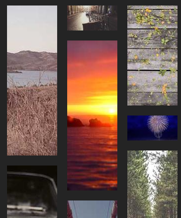

# Vue WF

[](https://codetime.dev)

<p align="center" style="overflow: hidden; border-radius:">
  
</p>

## Install

```bash
pnpm install vue-wf
```

## Usage

```vue
<script setup lang="ts">
import Waterfall from 'vue-wf'

const tmps = Array.from({ length: 100 })
const heights = [50, 100, 200, 300, 400]
const width = 100
const items = tmps.map(() => {
  const height = heights[Math.floor(Math.random() * heights.length)]
  return {
    width,
    height,
    src: `https://picsum.photos/${width}/${height}?random=${Math.random()}`,
  }
})
</script>

<template>
  <Waterfall :wrapper-width="400" :item-width="width" :gap="20">
    <div
      v-for="item, i in items" :key="i" :style="{
        height: `${item.height / item.width * 100}px`,
        backgroundImage: `url(${item.src})`,
      }"
    />
  </Waterfall>
</template>
```

## Development

```bash
pnpm install
pnpm -r build
pnpm dev:all
```
